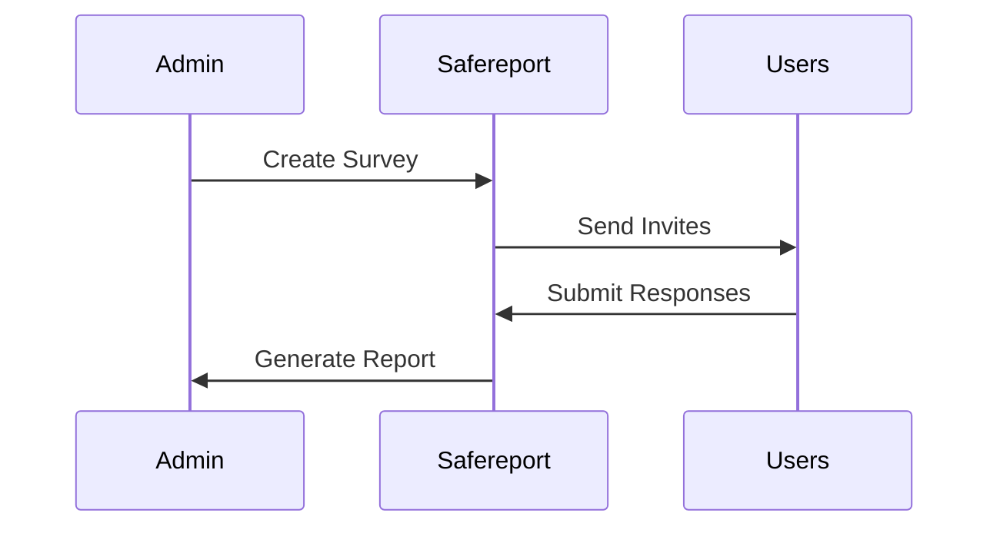

## Overview

Safereport provides a comprehensive platform for managing whistleblowing reports, ombudsman channels, and compliance tools. You can centralize anonymous reports, conduct investigations securely, and ensure adherence to regulations like LGPD and ISO 37001. This guide covers core features and practical use cases to help you implement ethical reporting workflows effectively.

<Columns cols={3}>
  <Card title="Anonymous Reports" icon="shield" href="/features/reports">
    Handle secure, anonymous submissions with full traceability for investigations.
  </Card>
  <Card title="Ouvidoria Channels" icon="message-circle" href="/features/ouvidoria">
    Set up multiple channels including web, WhatsApp, and email for user feedback.
  </Card>
  <Card title="Climate Surveys" icon="bar-chart" href="/features/surveys">
    Run surveys and audits to monitor organizational health and compliance.
  </Card>
</Columns>

## Managing Anonymous Reports and Investigations

Create and manage anonymous reports effortlessly. Reports enter the system via multiple channels and trigger automated workflows for triage and investigation.

<Steps>
  <Step title="Receive Report" icon="inbox">
    Reports arrive anonymously. Safereport logs them with timestamps and metadata.

````javascript
// Example webhook payload for incoming report
{
  "reportId": "rep_123456",
  "channel": "web",
  "anonymous": true,
  "category": "harassment"
}
````
  </Step>
  <Step title="Assign Investigator" icon="user-check">
    Assign to team members with role-based access.
  </Step>
  <Step title="Track Progress" icon="activity">
    Monitor status updates and evidence collection in real-time.
  </Step>
  <Step title="Resolve and Close" icon="check-circle">
    Document outcomes and archive for audits.
  </Step>
</Steps>

<Callout kind="tip">
  Enable notifications via webhooks to integrate with your ITSM tools like Jira or Slack.
</Callout>

## Setting Up Ouvidoria and Psychosocial Support Channels

Ouvidoria channels allow stakeholders to submit feedback or requests for support. Configure multiple entry points for accessibility.

<Tabs>
  <Tab title="Web Portal" icon="globe">
    Users access a secure form at `https://dashboard.safereport.com/portal`.

    <ParamField path="category" param-type="string" required="true">
      Select from predefined categories like "feedback" or "support".
    </ParamField>

    <ParamField body="description" param-type="string" required="true">
      Detailed description of the issue.
    </ParamField>
  </Tab>
  <Tab title="WhatsApp Integration" icon="phone">
    Connect your business number for SMS-like reporting.

````javascript
// API call to verify WhatsApp setup
fetch('https://api.example.com/v1/channels/whatsapp', {
  method: 'POST',
  headers: { 'Authorization': 'Bearer YOUR_API_KEY' },
  body: JSON.stringify({ phoneNumber: '551234567890' })
});
````
  </Tab>
  <Tab title="Psychosocial Support" icon="heart">
    Link to counseling services with automated routing.
  </Tab>
</Tabs>

## Conducting Climate Surveys and Ethical Audits

Launch surveys to gauge employee sentiment and perform audits for compliance. Safereport aggregates responses anonymously.



<CodeGroup tabs="JavaScript,Python">
```javascript
// Fetch survey results
const results = await fetch('https://api.example.com/v1/surveys/{surveyId}/results', {
  headers: { 'Authorization': 'Bearer YOUR_API_KEY' }
});
```
```python
import requests
response = requests.get(
    'https://api.example.com/v1/surveys/{surveyId}/results',
    headers={'Authorization': 'Bearer YOUR_API_KEY'}
)
```
</CodeGroup>

<Expandable title="Advanced Audit Configuration" default-open="false">
  Customize audit templates with custom fields and scoring.

  | Field | Type | Required |
  |-------|------|----------|
  | policyViolation | boolean | true |
  | severity | string | true |
  | evidence | array | false |

  Use the dashboard to schedule recurring audits.
</Expandable>

<Callout kind="success">
  All features comply with Brazilian regulations including Lei 14.457 and LGPD. Start with a free trial to test configurations.
</Callout>